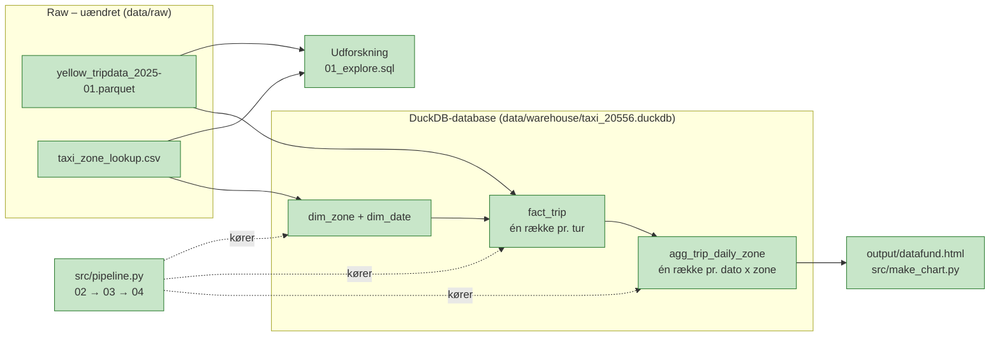
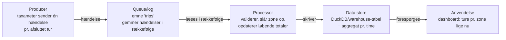
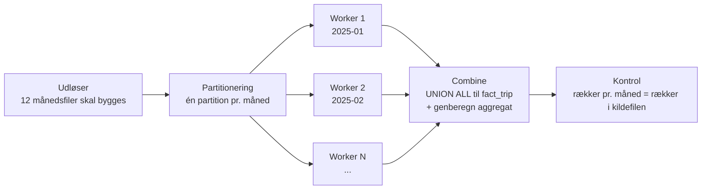

# Arkitektur

**Version 2.0 · Dag01 + Dag03 + Dag04**

## Indhold

1. [Data](#data)
2. [Analysebehov](#analysebehov)
3. [Arkitekturskitse](#arkitekturskitse)
4. [Dag03 – aggregate, lagring og genskabelse](#dag03--aggregate-lagring-og-genskabelse)
5. [Dag04 – processing og pipeline](#dag04--processing-og-pipeline)

## Data

**Yellow Taxi (`yellow_tripdata_2025-01.parquet`):** Én rå række repræsenterer:

> Én taxitur med en Yellow Taxi i NYC, registreret af taxameteret: start/slut-tidspunkt, pickup/dropoff-zone, distance og betaling. Filen har 3.475.226 rækker og 20 kolonner.

**Taxi Zone Lookup (`taxi_zone_lookup.csv`):** Én række repræsenterer:

> Én TLC-taxizone med ID (`LocationID`), bydel (`Borough`), zonenavn (`Zone`) og `service_zone`. Filen har 265 rækker, og `LocationID` er unik.

### Feltforklaringer

| Felt | Betydning | Enhed / værdier |
|---|---|---|
| `tpep_pickup_datetime` | Tidspunkt hvor taxameteret blev startet | Dato og tid |
| `PULocationID` / `DOLocationID` | TLC-zone hvor taxameteret blev startet / stoppet. Kobles til `LocationID` i zonefilen | Zone-ID (1–265) |
| `trip_distance` | Turens længde målt af taxameteret | Miles |
| `fare_amount` | Pris beregnet af taxameteret ud fra tid og distance | USD |
| `payment_type` | Hvordan turen blev betalt | 0 = Flex Fare, 1 = kreditkort, 2 = kontant, 3 = no charge, 4 = dispute, 5 = unknown, 6 = voided |
| `tip_amount` | Drikkepenge. Udfyldes automatisk ved kortbetaling – kontante tips er ikke med | USD |

Kilde: [TLC Yellow Taxi Data Dictionary](https://www.nyc.gov/assets/tlc/downloads/pdf/data_dictionary_trip_records_yellow.pdf)

### Observationer (raw-data er ikke ændret)

- Januar-filen indeholder 22 ture med pickup i december 2024 eller februar 2025.
- 261 af 265 zoner har pickups.
- Zonefilen har rækkerne "Unknown" og "N/A". De matcher i joins, men fortæller ikke hvor turen var.
- Kontante ture har altid tip 0, fordi kontante tips ikke registreres.
- `payment_type` 0 er en stor gruppe (540.149 ture), som bør undersøges nærmere.
- For VendorID 1 er `total_amount` 2,50 lavere end summen af beløbsfelterne. Måske indgår `congestion_surcharge` allerede i `extra`.

## Analysebehov

1. **Hvilke bydele har flest pickups, og hvor er den gennemsnitlige pris højest?** Bruger `PULocationID` + Zone Lookup (`Borough`) og `fare_amount`.
2. **Hvordan varierer antal ture og gennemsnitlig distance over ugens dage i januar?** Bruger `tpep_pickup_datetime` og `trip_distance`.
3. **Hvordan betaler kunderne, og hvor store er tips ved kortbetaling?** Bruger `payment_type`, `fare_amount` og `tip_amount`.

Alle tre kan besvares med de udleverede data. Behov 1 bruger Zone Lookup.

## Arkitekturskitse



### Forklaring

- **Raw-data** ligger uændret i `data/raw/`. Det er den originale kilde, så alt andet altid kan genskabes derfra.
- **Udforskning:** DuckDB læser Parquet- og CSV-filen direkte i `01_explore.sql`. Der gemmes ingen tabeller.
- **Modeled:** `dim_zone`, `dim_date` og `fact_trip` i DuckDB-databasen (Dag02).
- **Aggregate:** `agg_trip_daily_zone` oven på fact (Dag03).
- **Præsentation:** `src/make_chart.py` laver `output/datafund.html` fra aggregatet.

### Fil, engine, database og resultat

| Begreb | Hvad det er |
|---|---|
| Parquet-fil | Datafil på disken med de rå ture. Ikke en database. |
| DuckDB-engine | Programmet der udfører SQL – kan læse filer direkte. |
| DuckDB-databasefil | `taxi_20556.duckdb` – hvor gemte tabeller (fx `fact_trip`) ligger. |
| Query-resultat | Svaret på en query. Vises i terminalen og gemmes ikke, medmindre man laver en tabel. |

---

# Dag03 – aggregate, lagring og genskabelse

## Aggregate og informationstab

**Analysebehov:** Hvor mange ture starter i hver zone pr. dag, og hvordan udvikler antal ture og gennemsnitlig distance sig hen over januar?

| Tabel | Grain |
|---|---|
| `fact_trip` | én række = én taxitur |
| `agg_trip_daily_zone` | én række = én pickup-dato × én pickup-zone |

Aggregatet er materialiseret som en tabel i DuckDB (se `sql/04_aggregates.sql`). Kontrollerne dér viser, at hver kombination af dato og zone kun forekommer én gang, og at antal ture og summen af distance stemmer med `fact_trip`. Efter en genkørsel er rækketallet uændret, fordi tabellen bygges med `CREATE OR REPLACE`.

**Spørgsmål aggregatet kan besvare:** "Hvilke dage i januar havde flest ture, og hvilke zoner fylder mest?" Det virker, fordi dato, zone, antal ture og summen af distance er bevaret.

**Spørgsmål der kræver mere detaljerede data:** "Er gennemsnitsprisen højere ved kortbetaling end ved kontant, og hvilke dropoff-zoner bruges fra Times Square?" Det kan aggregatet ikke svare på, fordi `payment_type` og dropoff-zone ikke indgår i dets grain – de er væk i det informationstab, aggregeringen medfører.

**Gennemsnit efter yderligere aggregering:** Aggregatet gemmer `sum_distance_miles` og `ture_med_distance` i stedet for et færdigt gennemsnit. Et gennemsnit er ikke additivt: gennemsnittet af zonernes gennemsnit vægter en zone med 3 ture lige så meget som en zone med 30.000. Korrekt gennemsnit på et grovere grain beregnes som `SUM(sum_distance_miles) / SUM(ture_med_distance)`. `sql/04_aggregates.sql` viser begge beregninger side om side.

**NULL kontra nul:** `COUNT(trip_distance)` tæller ikke NULL. Ture med distance 0 er registrerede værdier og indgår, mens ture uden værdi trækkes fra nævneren. Et ukendt gennemsnit er ikke 0.

## Lagring og platform

```text
raw        data/raw/*.parquet, *.csv        original, skrivebeskyttet i praksis
modeled    taxi_20556.duckdb: dim_*, fact_trip   afledt, kan genbygges
aggregate  taxi_20556.duckdb: agg_trip_daily_zone afledt af fact
resultat   output/datafund.html              afledt af aggregate
```

**Valgt data store: DuckDB (en indlejret, kolonneorienteret analysedatabase i én fil).**
Adgangsmønsteret er få brugere, store scans og aggregeringer over 3,5 mio. rækker, ingen samtidige skrivninger. Kolonneformat gør, at kun de nødvendige kolonner læses, og databasen kræver ingen server.

- **Begrænsning:** DuckDB er bygget til én skrivende proces ad gangen og til data på én maskine. Den er ikke et flerbruger-BI-warehouse med adgangsstyring.
- **Alternativ:** Et cloud-warehouse (fx BigQuery eller Snowflake) hvis flere afdelinger skulle læse samme model samtidigt, med adgangsstyring og skalering – til gengæld med drifts- og forbrugsomkostninger.

**Perspektiv:** Projektets `data/raw/` svarer til ideen i et **data lake** (rå filer i deres oprindelige format), og DuckDB-tabellerne svarer til ideen i et **data warehouse** (modellerede tabeller til analyse). Et **lakehouse** kombinerer de to ved at lægge tabelformater (fx Delta eller Iceberg) oven på filerne i lagringen. En lokal mappe med to filer er en illustration af principperne – ikke en komplet platform med katalog, adgangsstyring og drift.

**Data Mesh** er ikke en databasetype, men en organisering: hvert domæne (fx "ture" og "zoner") ejer sine data som et produkt med ansvar for kvalitet, dokumentation og SLA. Hvis en organisation overtog løsningen, kunne et taxi-/trafikdomæne eje turdata og definitionen af "én tur", mens et geodata-team ejede zonerne. Det er uafhængigt af, om systemet driftes lokalt eller i cloud: **ejerskab og drift er to forskellige spørgsmål.**

## Bevaring og genskabelse

| Artefakt | Raw/afledt · persistent state | Version/identifikation | Retention og begrundelse | Backup/snapshot | Rebuild |
|---|---|---|---|---|---|
| `yellow_tripdata_2025-01.parquet` | Raw · persistent | Filnavn + måned + checksum (SHA-256) + downloaddato | Bevares permanent – kilden kan ændres eller fjernes hos TLC | Foreslået: kopi på eksternt drev/cloud | Kan ikke genbygges, kun hentes igen – og så er det måske en anden udgave |
| `taxi_zone_lookup.csv` | Raw · persistent | Filnavn + downloaddato + checksum | Bevares permanent – zonerne kan ændres over tid | Foreslået: samme kopi | Samme som ovenfor |
| SQL + Python + `requirements.txt` | Kode · persistent | Git-commit + Python 3.12 + duckdb 1.5.5 + pandas 3.0.5 | Bevares permanent | Etableret hvis projektet ligger i Git (kodehistorik, ikke databackup) | Er selv opskriften på rebuild |
| `taxi_20556.duckdb` (modeled + aggregate) | Afledt · persistent state | Bygget af pipeline-kørsel dato/tid | Kort – kan genbygges på minutter | Foreslået: snapshot/kopi af filen efter et vigtigt build | `pipeline.py` + raw + kode |
| `output/datafund.html` | Afledt (publiceret) · persistent | Dato i filnavn, fx `datafund_2026-09-18.html` | Bevares så længe resultatet bruges/refereres | Foreslået: gemmes sammen med den kode og det commit, der lavede det | `make_chart.py` + database |

**Begreberne:** *persistent state* = det, der overlever, når programmet slutter (filerne på disken). *Dataversion* = hvilken udgave af indholdet, vi taler om. *Retention* = hvor længe vi beholder det, og hvorfor. *Snapshot* = en kopi af tilstanden på et tidspunkt. *Backup* = en kopi et andet sted, som kan bruges til at gendanne. *Rebuild* = at bygge det afledte op igen fra raw + kode.

**Hvis databasefilen blev slettet, og råkilden online var ændret:**

1. Hent mine bevarede raw-filer frem fra backupkopien, ikke fra internettet.
2. Kontrollér deres checksum mod det, jeg noterede, så jeg ved, det er samme datasæt.
3. Tjek den kode ud (Git-commit), som resultatet blev lavet med, og genskab miljøet fra `requirements.txt`.
4. Kør `src/pipeline.py`, så `dim_*`, `fact_trip` og aggregatet bygges igen.
5. Kør `src/make_chart.py` og sammenlign med det gemte resultat (fx antal ture i januar).

**Hvad kan blokere det:** at raw-filen kun findes online (kilden er ændret), at afhængighedernes versioner ikke er noteret (anden DuckDB-version kan give andre resultater), eller at et filter kun fandtes i en ikke-gemt query.

**Git er ikke databackup:** Git versionerer kode, ikke datafiler på flere GB – og en slettet databasefil ligger ikke i Git. **En checksum er ikke backup:** den kan bevise, at en fil er ændret, men den kan ikke give filen tilbage. **Et snapshot af den afledte database er ikke raw-data**, og **rebuild er ikke restore**: rebuild laver resultatet forfra fra raw, mens restore henter en gemt kopi tilbage.

**Kilder:** TLC Data Dictionary (feltbetydninger), [DuckDB – Why DuckDB](https://duckdb.org/why_duckdb) (kolonneorienteret, indlejret engine), Kimball Group (aggregate og additivitet).

---

# Dag04 – processing og pipeline

## Den implementerede batch-pipeline

`src/pipeline.py` kører buildet i denne rækkefølge:

```text
02_dimensions.sql   ->  dim_zone, dim_date
03_fact_trip.sql    ->  fact_trip (foreign keys til dimensionerne)
04_aggregates.sql   ->  agg_trip_daily_zone (bygger på fact_trip)
```

**Rækkefølgen er dependencies, ikke smag:** `fact_trip` kontrolleres op mod dimensionerne, og aggregatet læser `fact_trip`. Byttes trinnene om, fejler kontrollerne eller tabellen findes ikke. `01_explore.sql` er udforskning og indgår ikke i rebuildet.

**Fejl- og commit-adfærd:**

- Mangler en SQL-fil, eller indeholder den kun kommentarer, stopper pipelinen med det samme og siger hvilken fil.
- Hvert trin og hvert statement printes, så første fejl kan placeres.
- Hele buildet kører i én transaktion. Ved fejl køres `ROLLBACK`, så der ikke efterlades et halvt bygget resultat, og senere trin springes over.
- Forbindelsen lukkes i `finally`, både ved succes og fejl.
- Til sidst kontrolleres, at alle fire tabeller findes, og at antal ture i aggregatet stemmer med `fact_trip`.
- **Genkørsel fordobler ikke data**, fordi SQL-filerne bruger `CREATE OR REPLACE TABLE`: tabellen bygges forfra frem for at få nye rækker tilføjet.

## ETL eller ELT?

Løsningen er **ELT**: rådata *loades* først uændret ind i lageret (`data/raw/`, og læses direkte af DuckDB), og *transformationen* sker bagefter i SQL inde i destinationen.

**Navngivet destination:** DuckDB-databasen `data/warehouse/taxi_20556.duckdb`, tabellerne `dim_zone`, `dim_date`, `fact_trip` og `agg_trip_daily_zone`.

En ETL-variant ville rense og omforme data i et separat værktøj *før* indlæsning, så lageret kun modtog færdige tabeller. ELT er valgt her, fordi engine'en kan læse Parquet direkte, og fordi raw skal bevares uændret.

## Genkørsel kontra nyt månedligt batch

| | Samme input igen | Nyt batch (fx februar-filen) |
|---|---|---|
| Hvad sker der | Tabellerne bygges forfra af de samme rækker | Nye rækker skal med i modellen |
| Resultat | Samme rækketal – ingen fordobling | `dim_date` skal udvides, `fact_trip` vokser |
| Risiko | Ingen | Dubletter, hvis samme fil læses to gange; `trip_key` fra `ROW_NUMBER()` bliver tildelt på ny |
| Hvad kræves | Intet ekstra – dette er implementeret og testet | En kolonne der identificerer kildefilen/måneden, og en beslutning om full rebuild eller inkrementel load |

I dag læser SQL-filerne én navngiven fil. Full rebuild af alle måneder er den enkle, sikre løsning; inkrementel indlæsning er **ikke** implementeret og bør ikke påstås, før den er designet og testet.

## Tænkt streamingvariant (ikke implementeret)



Forskellen fra batch: i batch behandles en hel måned på én gang, når filen findes. I streaming ankommer hændelserne løbende, og resultatet er altid "indtil videre". Til gengæld skal man håndtere forsinkede og gentagne hændelser.

**Transformation, queue/log og orchestration er tre forskellige ting:**

- **Transformation** = selve beregningen (SQL'en, der laver fact og aggregat).
- **Queue/log** = transporten og bufferen mellem afsender og modtager, så de kan køre i forskelligt tempo (fx Kafka, RabbitMQ).
- **Orchestration** = styringen af *hvilke* jobs der kører hvornår og i hvilken rækkefølge, med genforsøg og status (fx Airflow). Min `pipeline.py` er en meget simpel orchestrator for tre trin.

## Konceptuelt paralleliseringsdesign (ikke implementeret)



Parallelisering giver mening, når arbejdet kan deles i dele, der ikke afhænger af hinanden. Måneder er sådan en partition: hver fil kan behandles for sig.

**Trade-offs:** flere workers kræver koordinering og mere hukommelse/IO, og combine-trinnet bliver flaskehalsen. Nøgler som `ROW_NUMBER()` skal gøres unikke pr. partition (fx måned + løbenummer), ellers kolliderer de. Ved 3,5 mio. rækker på én maskine er DuckDB hurtig nok uden dette; designet bliver først relevant ved mange måneder eller flere datakilder.

## Hvad er implementeret, og hvad er kun foreslået?

| | Status |
|---|---|
| Batch-pipeline 02 → 03 → 04 med transaktion og kontrol | **Implementeret og testet** |
| Genkørsel uden fordobling | **Implementeret og testet** |
| Fejlscenarie (manglende/tom SQL-fil) | **Afprøvet** |
| Præsentation i `output/datafund.html` | **Implementeret** |
| Nyt månedligt batch / inkrementel load | Foreslået |
| Streamingvariant | Kun konceptuelt diagram |
| Parallel processing | Kun konceptuelt design |
| Kafka, Airflow, Spark | Ikke installeret og ikke nødvendigt her |

**Kilder:** [DuckDB Python API](https://duckdb.org/docs/current/api/python/overview), [DuckDB – Transactions](https://duckdb.org/docs/current/sql/statements/transactions), [Mermaid – Flowcharts](https://mermaid.js.org/syntax/flowchart.html).
