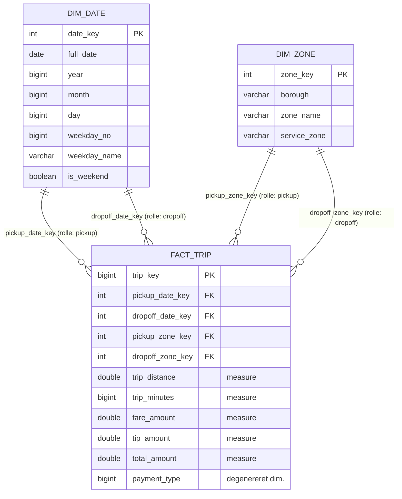

# Datamodel

**Version 1.2 · Dag02**

## Indhold

1. [Første modelskitse](#1-første-modelskitse)
2. [Grain](#2-grain)
3. [Measures og dimensions](#3-measures-og-dimensions)
4. [Relationer og roller](#4-relationer-og-roller)
5. [Modeldiagram](#5-modeldiagram)
6. [Kontroller](#6-kontroller)
7. [Forklaring og kilder](#7-forklaring-og-kilder)

---

# 1. Første modelskitse

Valgte analysebehov fra Dag01:

| # | Analysebehov | Skal bruge | Tælle/måle | Gruppere efter |
|---|---|---|---|---|
| 1 | Hvilke bydele har flest pickups, og hvor er prisen højest? | zone-id + zonefil + pris | antal ture, gns. `fare_amount` | bydel/zone (pickup) |
| 2 | Hvordan varierer ture og distance over ugedagene? | pickup-tidspunkt + distance | antal ture, gns. `trip_distance` | ugedag, dato |
| 3 | Hvordan betaler kunderne? | `payment_type` + beløb | antal ture, gns. `fare_amount`, gns. `tip_amount` | betalingstype |

Én række i de centrale data bør repræsentere **én taxitur**, fordi alle tre behov tæller eller måler på ture.

Skitse med almindelige ord:

```text
En midtertabel med én linje pr. tur (tid, sted, distance, pris)
 - kobles til en tabel med oplysninger om zoner  (hvilken bydel er det?)
 - kobles til en tabel med oplysninger om datoer (hvilken ugedag er det?)
```

# 2. Grain

> Én række i `fact_trip` repræsenterer **én taxitur, som den er registreret i `yellow_tripdata_2025-01.parquet`** – fra taxameteret startes til det stoppes.

Der filtreres ikke, og der fjernes ikke dubletter. `fact_trip` har derfor præcis lige så mange rækker som rawfilen (3.475.226).

Grainet passer til analysebehovene, fordi alle tre spørgsmål handler om ture: antal ture, pris pr. tur og distance pr. tur. Et grovere grain (fx én række pr. zone pr. dag) ville gøre behov 3 umuligt, fordi betalingstypen hører til den enkelte tur. Det grovere grain bygges i stedet som et **aggregate** oven på `fact_trip` (Dag03).

# 3. Measures og dimensions

**Vigtigste measures** (tal, der kan lægges sammen pr. tur):

| Measure | Betydning | Enhed |
|---|---|---|
| `trip_distance` | turens længde ifølge taxameteret | miles |
| `trip_minutes` | varighed, beregnet som dropoff − pickup | minutter |
| `fare_amount` | pris beregnet af taxameteret | USD |
| `tip_amount` | drikkepenge (kun kortbetaling registreres) | USD |
| `total_amount` | samlet beløb opkrævet | USD |
| `passenger_count` | antal passagerer indtastet af chaufføren | antal |

**Vigtigste dimensions** (det, vi grupperer og filtrerer efter):

| Dimension | Nøgle | Attributter | Rolle(r) |
|---|---|---|---|
| `dim_zone` | `zone_key` (= TLC `LocationID`) | `borough`, `zone_name`, `service_zone` | pickup og dropoff |
| `dim_date` | `date_key` (YYYYMMDD) | `full_date`, `year`, `month`, `day`, `weekday_no`, `weekday_name`, `is_weekend` | pickup og dropoff |

`payment_type` ligger som kode direkte i `fact_trip` (degenereret dimension). Der er ikke bygget en `dim_payment`, fordi koden kun har seks værdier og ingen andre attributter i kilden.

**Forskellen på measure og dimension:** en measure er et tal, man regner på (SUM, AVG). En dimension er den kontekst, man grupperer tallene efter (bydel, ugedag). "Gennemsnitlig pris **pr. bydel**" = measure pr. dimension.

# 4. Relationer og roller

**`dim_zone` i to roller:** en tur har både en startzone (`PULocationID`) og en slutzone (`DOLocationID`). Begge peger på det samme ID-system, så `fact_trip` har to foreign keys – `pickup_zone_key` og `dropoff_zone_key` – der begge peger på `dim_zone.zone_key`. I en query joines tabellen to gange med hvert sit alias. Det kaldes en **role-playing dimension**, og det er grunden til, at vi ikke laver to næsten ens zonetabeller.

**`dim_date` i to roller:** på samme måde har turen en pickup-dato og en dropoff-dato. En tur kan starte 23:50 og slutte 00:10 dagen efter, så de to datoer er ikke altid ens. `dim_date` dækker derfor alle datoer fra den første til den sidste dato i **begge** kolonner, og kalenderen har ingen huller.

# 5. Modeldiagram



Kardinalitet: én dimensionsrække kan høre til mange ture (1:N). Modellen er et **star schema**: én fact-tabel i midten med dimensionerne direkte omkring sig. En snowflake-variant ville splitte `dim_zone` op i fx `dim_zone` → `dim_borough`; det sparer plads, men kræver et ekstra join i næsten hver query.

# 6. Kontroller

Alle kontroller står som SQL i `sql/02_dimensions.sql` og `sql/03_fact_trip.sql`.

| Kontrol | Hvad den viser | Fil |
|---|---|---|
| `COUNT(*)` vs. `COUNT(DISTINCT zone_key)` | zone-nøglen er entydig | 02 |
| `COUNT(*)` vs. `COUNT(DISTINCT date_key)` + min/max | dato-nøglen er entydig, og perioden er dækket | 02 |
| pickup-/dropoff-datoer uden match i `dim_date` | datodimensionen dækker **begge** roller | 02 |
| rækker i raw vs. rækker i `fact_trip` | grainet er 1:1 med kilden | 03 |
| `COUNT(*)` vs. `COUNT(DISTINCT trip_key)` | den tekniske nøgle er entydig | 03 |
| manglende matches i alle fire roller | relationerne dækker data | 03 |
| rækker før og efter join til alle fire dimensionsroller | joins mangedobler ikke fact-rækker | 03 |

> Resultater indsættes som `-- RESULTAT:`-kommentarer i SQL-filerne, når de er kørt.

# 7. Forklaring og kilder

**Hvorfor dette grain?** Rawfilen har én linje pr. tur, og alle analysebehovene tæller eller måler ture. Ved at holde fact på samme grain som kilden kan alle tal afstemmes mod raw, og grovere opgørelser kan altid beregnes ovenpå.

**Hvorfor de nøgler?** `dim_zone` bruger TLC's eget `LocationID` som nøgle (natural key). Det er allerede unikt og stabilt, og det står i tripdata, så der skal ikke opslås via navne. `dim_date` bruger `YYYYMMDD` som heltal – læsbart og identisk ved hver genopbygning. `trip_key` er en teknisk nøgle (surrogate key) lavet med `ROW_NUMBER()`; den identificerer én række i `fact_trip`, men er ikke en forretningsnøgle. Ved en genopbygning fra samme rawfil sorteres rækkerne ens, men to fuldstændig identiske ture kan bytte nummer. Skal nøglen kunne følges over tid, skal den bygges på felter, der identificerer turen.

**Grain vs. primary key:** grain er *betydningen* af en række ("én tur"). Primary key er den *tekniske identifikation* af rækken (`trip_key`).

**Kilder:**

- [TLC Yellow Taxi Data Dictionary](https://www.nyc.gov/assets/tlc/downloads/pdf/data_dictionary_trip_records_yellow.pdf) – felternes betydning, enheder og koder
- [Kimball Group – Dimensional Modeling Techniques](https://www.kimballgroup.com/data-warehouse-business-intelligence-resources/kimball-techniques/dimensional-modeling-techniques/) – grain, fact/dimension, role-playing dimension, degenereret dimension
- [DuckDB – CREATE TABLE](https://duckdb.org/docs/current/sql/statements/create_table) og [Date functions](https://duckdb.org/docs/current/sql/functions/date) – implementering
- [Mermaid – Entity Relationship Diagrams](https://mermaid.js.org/syntax/entityRelationshipDiagram.html) – diagrammet
